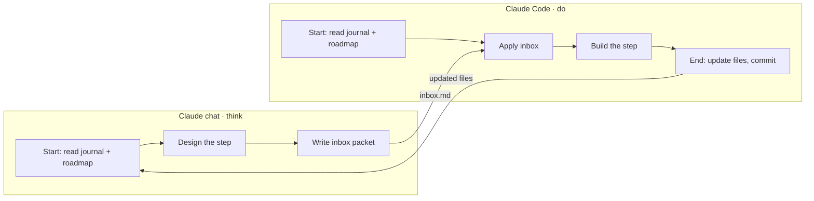

# relay

A Claude skill that gives long projects a memory. Plain markdown files track the plan, progress and decisions, so every session picks up where the last one stopped. Chat thinks, Claude Code does.

Works alone or with [superpowers](https://github.com/obra/superpowers).

## Install

- **claude.ai:** Settings → Capabilities → turn on code execution. Customize → Skills → + → Upload a skill → `relay.zip`. Also syncs to Claude Code on the same account.
- **Claude Code only:** copy `relay/` to `~/.claude/skills/`.

## Start

In chat or Claude Code:

> I'm starting a project using the relay skill.

## How it works

Every session: **start** (read journal, confirm the step) → **work** → **end** (update files, log decisions, journal entry).

## Planning

## Files

| File | Purpose |
|---|---|
| `CLAUDE.md` | Loads the rules into every Claude Code session |
| `instructions.md` | Session checklists and rules |
| `roadmap.md` | The plan; `← CURRENT` marks the next step |
| `journal.md` | Session log; last entry says where to resume |
| `journal-archive.md` | Older journal entries |
| `decisions.md` | Why things are the way they are |
| `index.md` | Map of project files |
| `costs.md` | API spend |
| `inbox.md` | Chat work waiting for Claude Code |
| `superpowers.md` | Handoff rules (superpowers users only) |

Chat-only projects need just `instructions`, `roadmap`, `journal`, `decisions`.

## With and without superpowers

| | Without | With |
|---|---|---|
| Design | Chat | Chat |
| Handoff | Inbox packet with exact changes | Inbox packet with an approved spec |
| Build | Claude Code, step by step | Superpowers: plan, test-first build, review |
| Mid-build questions | Stops to ask | Decides, logs the call |
| Done means | Shown working | Tests pass + review clean |
| Model per code step | Tagged Haiku/Sonnet/Opus; you switch | Superpowers picks |
| Non-code steps | This workflow | This workflow |
| Rules per session | ~1,400 tokens | ~3,500 tokens |

Design method adapted from superpowers' brainstorming skill.
