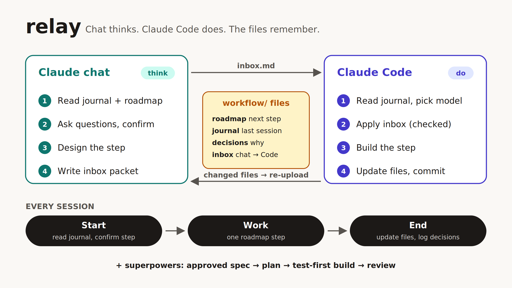
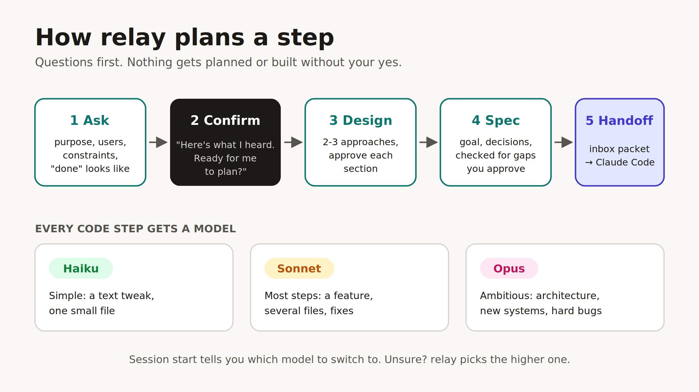
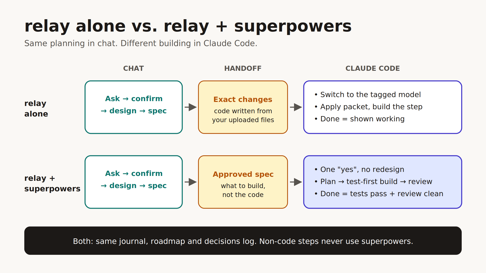

# relay

A Claude skill that gives long projects a memory. Plain markdown files track the plan, progress and decisions, so every session picks up where the last one stopped. Plan in a Claude Project, build in Claude Code.

Works alone or with [superpowers](https://github.com/obra/superpowers).

## What makes it different

- **Chat and Code work together.** Plan in a Claude Project (phone-friendly), build in Claude Code. An inbox file hands work between them.
- **Works with superpowers.** Chat designs, superpowers builds test-first. Built-in rules stop them from clashing.
- **Right model per step.** Code steps are tagged Haiku, Sonnet or Opus.
- **Asks before planning.** Questions first, then your go-ahead, then the plan.
- **Stays on plan.** A roadmap cursor and scope guard stop drift; a decisions log keeps settled questions settled.
- **Keeps the Project in sync.** Each Code session ends by updating your Project's files (or one click on Sync now).
- **Adapts to you.** Beginners get plain-language explanations; experienced devs don't.

## Install

- **claude.ai:** Settings → Capabilities → turn on code execution. Customize → Skills → + → Upload a skill → `relay.zip`. Also syncs to Claude Code on the same account.
- **Claude Code only:** copy `relay/` to `~/.claude/skills/`.

## Start

In a Claude Project chat or in Claude Code:

> I'm starting a project using the relay skill.

Project instructions to paste (claude.ai → your Project → instructions):

> If instructions.md is in this Project, read it and follow its Session Start Checklist before any work. If it isn't, set up the project with the relay skill.

## How a session works

**Start** (read journal, confirm the step and model) → **Work** (one roadmap step) → **End** (update files, log decisions, journal entry, sync the Project).

## Planning

## Keeping your Project in sync

Code changes files; chat reads the Project's copies. At the end of each Code session, relay uses the first route that works:

1. **Code session attached to your Project:** uploads the changed files directly.
2. **Repo on GitHub:** pushes, then you click **Sync now** in your Project's files. Link the repo once: Project files → + → GitHub.
3. **Neither:** lists the files to re-upload.

Chat also checks the journal's "Files changed" lines and asks you to sync before writing code against a stale copy.

## Files

| File | Purpose |
|---|---|
| `instructions.md` | Session checklists and rules |
| `roadmap.md` | The plan; `← CURRENT` marks the next step; model tag per code step |
| `journal.md` | Session log; last entry says where to resume and which files changed |
| `decisions.md` | Why things are the way they are |
| `inbox.md` | Chat work waiting for Claude Code |
| `index.md` | Map of project files |
| `costs.md` | API spend |
| `journal-archive.md` | Older journal entries |
| `CLAUDE.md` | Loads the rules into every Claude Code session |
| `superpowers.md` | Handoff rules (superpowers users only) |

Chat-only projects need just `instructions`, `roadmap`, `journal`, `decisions`.

## With and without superpowers

| | Without | With |
|---|---|---|
| Design | Chat | Chat |
| Handoff | Inbox packet with exact changes | Inbox packet with an approved spec |
| Build | Claude Code, step by step | Superpowers: plan, test-first build, review |
| Mid-build questions | Stops to ask | Decides, logs the call |
| Done means | Shown working | Tests pass + review clean |
| Model per code step | Tagged Haiku/Sonnet/Opus; you switch | Superpowers picks |
| Non-code steps | relay | relay |
| Rules per session | ~1,700 tokens | ~3,200 tokens |

Design method adapted from superpowers' brainstorming skill.
